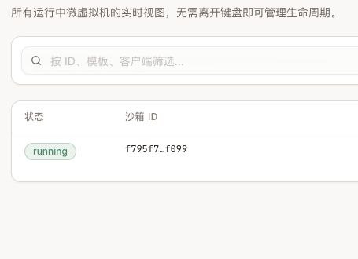
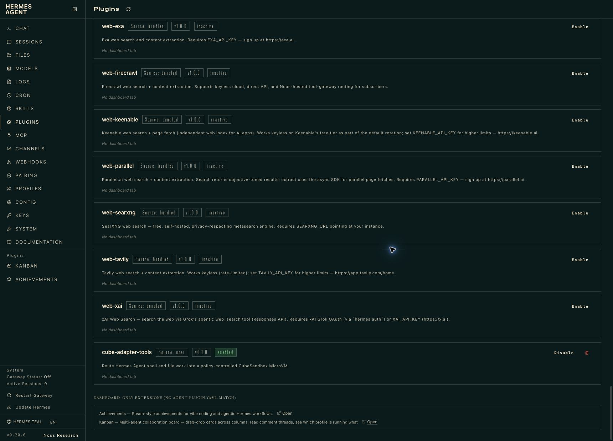
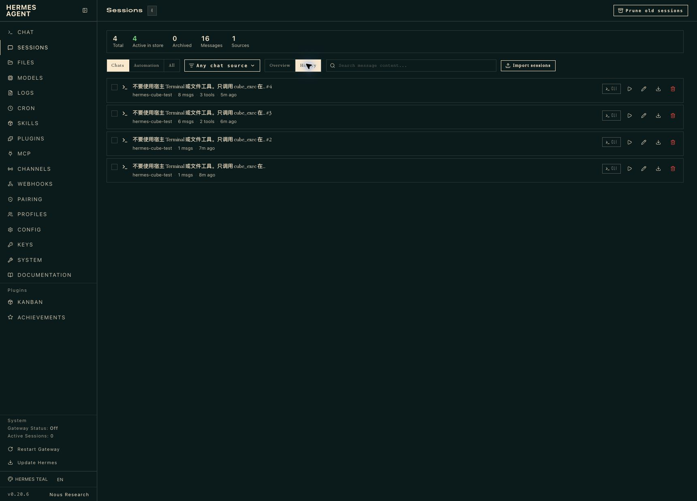

# cubesandbox-agent-adapter

[English](README.md) | [简体中文](README.zh-CN.md)

这是一个社区集成项目，用于把 OpenClaw、DeepSeek Harness（DSH）、Hermes
Agent 以及 Codex 等 MCP Host 的工具调用，经受控策略路由到
[CubeSandbox](https://github.com/TencentCloud/CubeSandbox) MicroVM 中执行。

```text
OpenClaw Tool Plugin ──────────┐
DSH Cordis Plugin ─────────────┤
Hermes Tool Plugin ────────────┼─ 认证 HTTP ─→ Adapter ─→ Cube SDK ─→ MicroVM
Codex / MCP Host ─→ MCP stdio ─┘                          │
                                                        └─ 脱敏 JSONL 审计
```

Adapter 是唯一持有 Cube 连接配置、完整 Sandbox ID 和流量令牌的组件。Runtime
插件只获得不透明租约；返回给模型的是短 Sandbox 引用，不包含底层凭据。

> **项目状态：** `v0.4.0` 是面向生产形态的参考实现，已经支持持久化加密租约、
> 多租户策略和带审批的可信任务流程，但上线前仍需完成部署侧加固，并在每个目标
> CubeSandbox 环境重新验收。

## 新用户从哪里开始

部署顺序是：**准备 CubeSandbox → 部署 Adapter → 接入一个 Agent → 执行并释放沙箱**。
本仓库的安装器只安装 Adapter 或客户端插件；CubeSandbox、READY 沙箱模板和 Agent
应用需要提前准备。模型 API 配置在 Agent 侧，Adapter 本身不需要模型 API Key。

| 你的情况 | 从哪里开始 |
| --- | --- |
| 已有 CubeSandbox，想在电脑或单机服务器上部署 | [Docker Compose 部署指南](docs/deploy-docker.zh-CN.md)，使用发布镜像，不需要 Kubernetes |
| 已有 Kubernetes 和 CubeSandbox | [Kubernetes 安装](#一键部署-kubernetes-adapter)，准备 kubectl、Helm 和集群访问配置 |
| 还没有 CubeSandbox | 先按下面的 CubeSandbox 部署链接安装后端，制作 READY 模板并验证能创建沙箱，再部署 Adapter |
| 基础执行已跑通，想使用训练、清洗和审批 | [可信执行指南](docs/trusted-execution.zh-CN.md)与[任务模板](examples/trusted-execution/)，这些需要额外配置，不会在安装后自动启用 |

无论选择 Docker 还是 Kubernetes，都需要从 Adapter 所在环境可访问的 CubeAPI 地址、
CubeProxy 地址/端口和 READY 模板名称；CubeAPI 开启认证时还需配置其凭据。

## CubeSandbox 和 Kubernetes 到底是什么关系

CubeSandbox 是沙箱执行系统，Kubernetes 是可选的部署与运维平台。CubeSandbox
**并不依赖 Kubernetes 才能运行**：官方的
[单机/裸金属部署](https://github.com/TencentCloud/CubeSandbox/blob/master/docs/zh/guide/bare-metal-deploy.md)
可以直接在 Linux 上通过 systemd 管理控制面和计算面，部分依赖服务使用容器承载。

当需要多控制面/多计算节点、声明式配置、健康检查、滚动运维、Secret、NetworkPolicy
以及统一监控时，Kubernetes 才体现出价值。官方
[Kubernetes 部署](https://github.com/TencentCloud/CubeSandbox/blob/master/docs/zh/guide/kubernetes/index.md)
用 Deployment 承载控制面、DaemonSet 承载计算面；它不会替代底层的虚拟化、内核、
存储和网络要求，上游也仍明确列有计算节点升级限制。

本项目同样解耦：Adapter 可以直接运行或通过 Compose 连接任何可达的
CubeAPI/CubeProxy；Helm Chart 只是进一步提供 Kubernetes 生命周期、策略、Secret
和高可用集成。因此 Kubernetes 是运维选择，不是 SDK 硬依赖。

## 办公网本地 Agent 到生产网的受控可信执行

另一类典型场景是：开发者习惯在办公电脑使用 Codex、Claude Code 等本地 Code
Agent，但训练数据、GPU、内部 API 和生产数据库只能在隔离的生产网访问。此时可以把
Adapter 部署在生产侧，通过 HTTPS、mTLS/OIDC 和租户 Profile 向本地 Agent 暴露唯一
的受控入口；模型生成的代码在 CubeSandbox MicroVM 中执行，而不是在笔记本或生产
节点直接执行。

```text
本地 Code Agent -> 生产接入网关 -> Adapter -> 命名任务 + JSON Schema
                                      -> 独立审批 -> 固定 Profile -> MicroVM
```

这个模式可以让生产凭据、完整 Sandbox ID、数据卷和工作负载身份留在生产侧。命名任务
由服务端强制执行封闭 JSON Schema、固定命令参数、Profile、独立审批、输出白名单、
MicroVM 清理和签名 Execution Receipt；Action Scope 允许 Agent 使用 `task:*`，但拒绝
原始 exec、Job、文件、Artifact、PTY 和 Checkpoint 接口。这里的“可信执行”是策略
受控、隔离且可审计的执行面，不等同于带硬件远程证明的机密计算 TEE。

仓库新增了两套可运行参考模板：本地 Agent 发起异步训练任务，以及在只读生产数据上
执行数据清洗。模板包括固定 Profile 的 MCP 配置、Prompt、无第三方依赖的任务脚本和
合成测试数据：

- [完整可信执行设计与安全边界](docs/trusted-execution.zh-CN.md)
- [训练与数据清洗模板](examples/trusted-execution/)

## 实战证据

下面不是产品效果图，而是 OpenClaw、DSH、Hermes Agent、Codex、Adapter 和
Kubernetes 上的 CubeSandbox 实际联调截图。它们证明的是一次功能实验已经跑通，
不代表性能基准或生产就绪。

### OpenClaw 直接调用 Adapter

本次明确禁止读取 Skill 和使用宿主 `exec`。模型只调用 Adapter 注册的
`cube_exec` 与 `cube_release`；结果中的执行器是 `cubesandbox-microvm`，只向
模型暴露短引用 `45a28df5`：


### DSH 通过 Cordis Plugin 调用 Adapter

DSH 的完整轨迹记录了 `cube_exec`、`cube_release`、执行结果和短引用
`f795f7fc`。Profile Patch 同时禁用了常见宿主 Shell/FS 工具，避免同一轮任务一半
在宿主机、一半在 MicroVM：


### CubeSandbox WebUI 中的运行实例

DSH 命令保持运行期间，CubeSandbox 沙箱页面能看到同一个 `f795f7...` MicroVM
处于 `running`。截图只保留状态和省略后的 ID，节点、内网地址及完整 ID 均未公开：



### Adapter 脱敏审计

Adapter 审计页可以按 Runtime、动作、Request ID 和短 Sandbox 引用交叉验证
OpenClaw 与 DSH 的操作。它不记录命令正文、输出、令牌或完整 Sandbox ID：


### Hermes Agent 原生插件实战

Hermes 接入采用独立的原生 Tool Plugin，不修改 Hermes 核心代码。Hermes 0.20.6
官方 Dashboard 显示 `cube-adapter-tools` 来自用户插件目录，状态为 `enabled`，并且
安装时显式拒绝覆盖内置工具：



本次实战会话共有 8 条消息、3 次工具调用。Hermes 默认会压缩工具目录，延迟加载的
插件工具可能先通过 `tool_describe` 与 `tool_call` 暴露给模型，最终仍会落到插件的
`cube_exec` 和 `cube_release` Handler：



60 秒命令执行期间，CubeSandbox WebUI 出现同一条 `3b287c...` MicroVM，状态为
`running`，规格为 2C/2GiB：


命令结束后，审计页使用相同短引用 `3b287c8f` 串起 `acquire`、`exec` 与
`release`；Runtime 为 `hermes`，结果均为 `ok`，活动租约归零：


### v0.3.0 四客户端应用验收

2026-09-02，将 v0.3.0 Adapter 部署到 Kubernetes 验收环境后，分别从真实的
OpenClaw、DSH、Hermes Agent 和 Codex 应用完成了端到端调用。下面全部是应用自身
Light 模式截图，不是重新绘制的证据卡。验收时 Adapter Deployment 为 `1/1`
Ready、容器重启为 0；每轮最后都执行了 `cube_release(action=kill)`，测试结束后
Adapter 活跃租约为 0。

| 客户端 | 实际链路 | 验收结果 |
| --- | --- | --- |
| OpenClaw | Tool Plugin → Adapter → CubeSandbox | `cube_exec`、状态查询和释放成功 |
| DSH | Cordis Plugin → Adapter → CubeSandbox | `cube_exec`、状态查询和释放成功 |
| Hermes Agent | 原生 Tool Plugin → Adapter → CubeSandbox | 截图中直接呈现的四个核心工具完成执行和释放，并由 `cube_exec` 探测状态 |
| Codex | MCP stdio 门面 → Adapter → CubeSandbox | acquire、exec、status 和 release 成功 |

OpenClaw 在真实 Control UI 中执行 `OPENCLAW_APP_CUBESANDBOX_OK`，查询租约状态并
销毁 MicroVM：


DSH 通过 Cordis Plugin 执行 `DSH_APP_CUBESANDBOX_OK`，并在 DSH Web 中完成状态
查询和清理：


Hermes Agent 从官方 Dashboard 执行 `HERMES_APP_CUBESANDBOX_OK`。本次截图使用的
隔离安装直接呈现了 `cube_exec`、`cube_read`、`cube_write` 和 `cube_release` 四个
核心工具，因此模型使用第二次 `cube_exec` 探测状态。当前源码声明了 19 个
插件工具，但这张截图只证明当次执行与释放链路，不把它表述成全部 Hermes 工具验收：


Codex 通过 Adapter 的 stdio MCP 门面，仅启用 `cube_acquire`、`cube_exec`、
`cube_status` 和 `cube_release`，执行 `CODEX_APP_CUBESANDBOX_OK`，观察到运行中租约
后将其销毁：


#### 四个真实客户端调用可信任务新功能

2026-09-04 又从四个客户端应用实测了新的策略受控链路。每轮只调用
`cube_task_plan` → `cube_task_submit` → `cube_task_status` → `cube_task_result` →
`cube_task_receipt`，最终任务状态为 `succeeded`，MicroVM 清理为 `verified`，Receipt
算法为 HS256。


Hermes 截图里的“6 tools”由 1 次 `tool_describe` 工具发现和 5 次可信任务调用组成。
更完整的验收范围和后端证据见[可信执行文档](docs/trusted-execution.zh-CN.md)。

截图没有暴露 Bearer Token、网关地址、完整 Sandbox ID 或私有集群标识；Hermes
截图中的本地路径、完整 Plan/Task/Sandbox 标识和原始签名 Receipt 载荷已做可见遮挡。
模型凭据只通过环境变量引用，没有写入仓库。

验收时不要只看 Agent 最终回复。建议同时核对以下证据链：

```text
Agent 工具结果中的 sandbox_ref
       = CubeSandbox WebUI 中的运行实例短引用
       = Adapter JSONL 审计中的 Sandbox 引用
```

执行 `cube_release(action=kill)` 后，还应确认 WebUI 运行实例归零，并且异常路径
同样会清理租约。

## 项目包含什么

- 使用 `cubesandbox==0.7.0` 的带认证 Python Adapter；
- 默认拒绝公网的声明式 Profile，并提供持久卷与检查点能力门控；
- OpenClaw、DSH、Hermes 共用 19 个执行、文件、异步 Job、检查点和可信任务工具，
  并提供 Codex 等 Host 可使用的 MCP 门面；
- DSH Cordis Plugin，以及禁用常见宿主 Shell/FS 工具的 Profile Patch；
- 通过官方 Plugin Doctor 校验的 Hermes Agent 原生 Tool Plugin；
- Kubernetes、OpenClaw、DSH 和 Hermes Agent 一键安装脚本；
- 本地开发用 Docker Compose；
- Helm Chart、纯 Kubernetes Manifest、测试和镜像发布流水线；
- Redis 加密恢复和多副本分布式锁；
- 分租户 Bearer、OIDC、TLS/mTLS；
- Prometheus 指标、依赖感知 Readiness 和可插拔审计 Sink；
- 基于官方 SDK 的 MCP stdio 门面；
- 追加写入、默认脱敏的 JSONL 审计事件；
- 服务端强制的训练/数据清洗 TaskTemplate：JSON Schema、Action Scope、独立审批、
  输出策略、清理确认和签名 Execution Receipt。

最新版本与 Issue 评估见 [CubeSandbox 上游状态](docs/cubesandbox-upstream.md)。

## 前置条件

安装前请确认：

1. CubeSandbox 已经运行，且 `agent-code` 一类模板 alias 处于 `READY`；
2. Adapter 能访问 CubeAPI 和 CubeProxy；
3. 目标 OpenClaw、DSH 或 Hermes Runtime 能访问 Adapter；
4. 部署到 Kubernetes 时已经安装 `kubectl` 和 `helm`；
5. 安装对应插件时已经安装 `openclaw`、`dsh` 或 `hermes`。
6. 本地 Python 开发与 MCP 门面使用 Python 3.10 或更高版本。

安装器不会安装 CubeSandbox 本身。Kubernetes 节点的 KVM、XFS、bpffs、CNI、
存储和权限要求，请先阅读[部署条件与生产评估](https://aik8s.run/ai-k8s/rag-agent/cubesandbox-kubernetes/)。

Hermes 路径已在 macOS Apple Silicon 的 Hermes Agent 0.20.6 与 CubeSandbox
0.7.0 Kubernetes 实验集群上完成真实联调。

## 一键部署 Kubernetes Adapter

克隆仓库：

```bash
git clone --branch v0.4.0 --depth 1 https://github.com/aik8s/cubesandbox-agent-adapter.git
cd cubesandbox-agent-adapter
```

一条命令部署 Adapter：

```bash
./scripts/install.sh adapter \
  --context <kube-context> \
  --cube-api-url http://cube-api.cube-system.svc:3000 \
  --cube-proxy-host cube-proxy.cube-system.svc \
  --cube-proxy-port 80 \
  --template agent-code
```

该命令会：

- 在需要时创建 `agent-runtime` Namespace；
- 如果 Secret 不存在，创建带独立随机 Bearer Token 和 HMAC Key 的
  `cube-adapter-auth`；
- 用 Helm 安装单副本 Adapter；
- 等待 Deployment Ready；
- 全程不打印上述两个 Secret。

可按需覆盖镜像、Namespace 或使用已有 Secret：

```bash
./scripts/install.sh adapter \
  --namespace my-agent-runtime \
  --release cube-adapter \
  --secret existing-adapter-secret \
  --image ghcr.io/aik8s/cubesandbox-agent-adapter:v0.4.0 \
  --cube-api-url https://cube-api.example.internal \
  --cube-api-port 443 \
  --cube-proxy-host cube-proxy.example.internal \
  --cube-proxy-port 443 \
  --template agent-code
```

默认 NetworkPolicy 只接受同一 Namespace 中带以下标签的客户端 Pod：

```yaml
cubesandbox-agent-adapter-client: "true"
```

如果 CubeAPI 或 CubeProxy 不在 `cube-system`，安装前要调整 Chart 的出站策略。
`--disable-network-policy` 只应用在平台已经通过其他方式管理等价网络策略的场景。

完整的 CubeSandbox 集群安装、模板制作和第一个 MicroVM 验收见
[Kubernetes 部署实战](https://aik8s.run/ai-k8s/rag-agent/cubesandbox-kubernetes-practice/)。

## 一键接入 OpenClaw

本地 OpenClaw 可以先端口转发 Adapter：

```bash
kubectl -n agent-runtime port-forward \
  service/cube-agent-adapter-cubesandbox-agent-adapter 18080:18080
```

另开终端，一条命令安装插件、把现有 Bearer Token 导出到权限为 `0600` 的文件、
合并插件/工具 Allowlist，并校验 OpenClaw 配置：

```bash
./scripts/install.sh openclaw \
  --adapter-url http://127.0.0.1:18080 \
  --namespace agent-runtime \
  --token-from-secret cube-adapter-auth
```

然后重启 OpenClaw Gateway。安装器会合并现有的 `plugins.allow` 和
`tools.alsoAllow`，不会覆盖用户原有配置。

当 OpenClaw 运行在 Kubernetes 中时，把同一个 Secret 只读挂载到 Runtime，
然后使用容器内路径：

```bash
./scripts/install.sh openclaw \
  --adapter-url http://cube-agent-adapter-cubesandbox-agent-adapter.agent-runtime.svc:18080 \
  --token-file /var/run/secrets/cube-adapter/token
```

对于不可信 Profile，要另外拒绝宿主 `exec/read/write` 工具。安装 Cube 插件并
不会自动关闭 OpenClaw 的其他执行后端。

## 一键接入 DSH

一条命令安装 Cordis Plugin，并生成权限为 `0600` 的 Profile Patch：

```bash
./scripts/install.sh dsh \
  --adapter-url http://127.0.0.1:18080 \
  --namespace agent-runtime \
  --token-from-secret cube-adapter-auth \
  --profile web
```

生成的 Patch 会禁用 `tool-bash`、`tool-pwsh`、`tool-fs`、
`tool-fs-search` 和 `tool-str-replace-editor`，再注册完整 Cube 工具集。可以使用
安装器打印的命令启动 DSH，或安装后立即启动：

```bash
./scripts/install.sh dsh \
  --adapter-url http://127.0.0.1:18080 \
  --token-from-secret cube-adapter-auth \
  --start
```

DSH 的本地 `file:` 安装会把包复制到插件目录。插件源代码变化后要重新执行安装
命令；只重启 DSH 不会刷新旧副本。

## 一键接入 Hermes Agent

一条命令安装并配置独立的 Hermes 原生插件：

```bash
./scripts/install.sh hermes \
  --adapter-url http://127.0.0.1:18080 \
  --namespace agent-runtime \
  --token-from-secret cube-adapter-auth
```

安装器会从本仓库下载插件、在明确拒绝覆盖 Hermes 内置工具的前提下启用它，写入
Adapter 地址、Token 文件路径和 `offline-code` Profile，然后以 CI 模式运行官方
Plugin Doctor。安装后启动一个新的受限会话：

```bash
hermes -t cube-adapter
```

插件注册全部 19 个通用执行和可信任务工具。启用 Hermes
工具压缩时，这些工具可能不会直接塞进模型 Prompt，而是先出现在内置的
`tool_describe` / `tool_call` 延迟目录中；这是正常行为，本仓库的真实联调已经覆盖
了这条路径。

安装插件不会全局关闭 Hermes 自带的宿主 Terminal 或文件工具。处理不可信任务时，
应使用 `cube-adapter` Toolset，并在生产会话所用 Profile 或 Gateway 策略中落实同样
的限制。

## Docker 部署与本地开发

首次部署请使用 [Docker Compose 部署指南](docs/deploy-docker.zh-CN.md)：它从 v0.4.0
发布镜像启动，包含密钥生成、网络地址选择、健康检查、真实沙箱验收、客户端接入和升级。
Docker 只承载 Adapter，仍需连接已部署的 CubeSandbox 后端。

已经按指南配置好 `.env` 时，发布镜像启动命令为：

```bash
docker compose pull adapter
docker compose up -d --no-build adapter
```

下面的开发流程用于修改源码后重新构建镜像；首次使用不需要本地构建。

生成开发 Secret、构建本地镜像并启动 Adapter：

```bash
./scripts/dev-up.sh \
  --cube-api-url http://host.docker.internal:13000 \
  --cube-proxy-host host.docker.internal \
  --cube-proxy-port 13080 \
  --template agent-code

curl -fsS http://127.0.0.1:18080/healthz
```

脚本会创建权限为 `0600` 的 `.env`，默认拒绝覆盖，并且只绑定
`127.0.0.1`。只有明确要轮换两个开发 Secret 时才使用 `--force`。Compose 会把
审计写入命名卷；测试重启恢复时可配置 Redis 状态变量并增加 `--profile ha`。

也可以手动启动：

```bash
cp .env.example .env
# 替换两个 Secret 占位符，并修改 Cube 端点。
chmod 600 .env
docker compose up -d --build
```

## API

API 包含健康/就绪/指标、租户租约、类型化文件与二进制 Artifact、同步执行、
支持 SSE 和取消的持久异步 Job、交互式 PTY、持久工作区、受 Profile 门控的
Checkpoint/Rollback/Fork，以及 `plan -> approve -> submit -> result/receipt` 可信任务。
完整契约见 [OpenAPI 文档](docs/openapi.yaml)。

每个 `POST` 都要求 `Authorization: Bearer …`。`acquire` 对
`(runtime, HMAC-SHA-256(session_key))` 幂等。HMAC Key 与 Bearer Token
相互独立，因此常规轮换 Bearer Token 不会改变脱敏后的会话关联值。

模型不能选择模板、CIDR、公开流量或生命周期策略。文件路径仅允许
`/workspace` 和 `/tmp`；请求、命令、文件、输出和超时均有上限。

## MCP stdio 门面

MCP 进程默认只作为本地 stdio 客户端访问带认证的 Adapter API。例如：

```json
{
  "mcpServers": {
    "cubesandbox": {
      "command": "/绝对路径/.venv/bin/python",
      "args": ["-m", "adapter.mcp_server"],
      "env": {
        "PYTHONPATH": "/绝对路径/cubesandbox-agent-adapter",
        "CUBE_ADAPTER_URL": "https://adapter.example.internal",
        "CUBE_ADAPTER_PROFILE": "offline-code",
        "CUBE_ADAPTER_TOKEN_FILE": "/run/secrets/cube-adapter/token",
        "CUBE_ADAPTER_CA_FILE": "/run/secrets/cube-adapter/ca.crt"
      }
    }
  }
}
```

只有回环地址允许明文 HTTP，避免把 Bearer Token 意外发送到远端明文连接。连接纯
mTLS Adapter 时可省略 Token 变量，并设置 `CUBE_ADAPTER_CLIENT_CERT_FILE` 与
`CUBE_ADAPTER_CLIENT_KEY_FILE`；`CUBE_ADAPTER_CA_FILE` 仍用于校验服务端证书。
`CUBE_ADAPTER_PROFILE` 由宿主持有，不暴露成模型可选的工具参数。

MCP 还提供 `cube_task_plan`、`cube_task_submit`、`cube_task_status`、
`cube_task_result`、`cube_task_cancel` 和 `cube_task_receipt`。审批故意不作为 Agent MCP
工具暴露，必须由独立 `approver` 身份调用认证 HTTP 接口。

## 审计

审计行包含 Runtime、带密钥的会话摘要、策略、动作、Request ID、短 Sandbox
引用、耗时和结果，不包含：

- Bearer Token 或 traffic token；
- 原始 session key；
- 完整 Sandbox ID；
- 命令正文和文件内容；
- stdout 和 stderr。

可选 `/audit` HTML 页面默认关闭，只用于受保护测试网络的演示。真实部署应把
JSONL 事件发送到持久、访问受控的审计流水线。

## 配置

| 环境变量 | 必填 | 用途 |
| --- | --- | --- |
| `CUBE_ADAPTER_TOKEN` | 三选一 | 共享 Bearer Token |
| `CUBE_ADAPTER_TOKENS_FILE` | 三选一 | 分租户 Bearer Principal JSON |
| `CUBE_ADAPTER_OIDC_JWKS_URL` | 三选一 | OIDC JWKS 地址 |
| `CUBE_ADAPTER_HMAC_KEY` | 是 | 独立的会话假名化 Key |
| `CUBE_ADAPTER_RECEIPT_HMAC_KEY` | 否 | 独立 Receipt 签名 Key；默认复用会话 HMAC Key |
| `CUBE_TEMPLATE_ID` | 是 | 平台维护的 READY 模板 alias |
| `CUBE_API_URL` | 是 | Adapter 可访问的 CubeAPI 地址 |
| `CUBE_API_KEY` | 按需 | CubeAPI 凭据，不会暴露给 Runtime 插件 |
| `CUBE_PROXY_NODE_IP` | 是 | Adapter 可访问的 CubeProxy Host |
| `CUBE_PROXY_PORT_HTTP` | 是 | CubeProxy HTTP 端口 |
| `CUBE_ADAPTER_AUDIT_LOG` | 否 | JSONL 路径；默认使用本地文件 |
| `CUBE_ADAPTER_AUDIT_UI` | 否 | 仅在受保护测试网络设为 `1` |
| `CUBE_ADAPTER_PROFILES_FILE` | 否 | 运维方维护的声明式 YAML Profile |
| `CUBE_ADAPTER_TASK_TEMPLATES_FILE` | 否 | 服务端任务 Schema、命令、审批与输出策略 |
| `CUBE_ADAPTER_STATE_BACKEND_URL` | HA/恢复 | `redis://` 或 `rediss://` |
| `CUBE_ADAPTER_STATE_ENCRYPTION_KEY` | 使用 Redis 时 | 持久记录 Fernet 加密 Key |
| `CUBE_ADAPTER_AUDIT_SINKS` | 否 | `file`、`stdout`、`http` 逗号列表 |
| `CUBE_ADAPTER_TLS_CERT_FILE` | 否 | HTTPS 服务端证书 |
| `CUBE_ADAPTER_TLS_CLIENT_CA_FILE` | 否 | 开启并校验 mTLS 客户端 |
| `CUBE_ADAPTER_SANDBOX_TIMEOUT` | 否 | Sandbox 超时，默认 300 秒 |
| `CUBE_ADAPTER_MAX_COMMAND_SECONDS` | 否 | 命令时长上限，默认 120 秒 |

Token Principal 的 `allowed_actions` / OIDC 的 `cube_actions` 支持精确 Action 和
`task:*` 一类族通配符；`allowed_task_templates` / `cube_task_templates` 限制命名任务。
省略字段时保留兼容的全允许行为；显式空列表会拒绝所有 Action 或任务。

Helm 仅使用 OIDC 或 mTLS 时设置 `auth.sharedTokenEnabled=false`。OIDC 必须同时
配置 issuer 和 audience；以 mTLS 证书主题作为身份时必须配置并验证客户端 CA。
当前三个 Runtime 插件使用 Bearer/OIDC Token；纯 mTLS 模式面向能提交客户端证书的
MCP 或自定义客户端。

启用 NetworkPolicy 后，外部 Prometheus 抓取器通过 `networkPolicy.extraIngress`
放行，外部 OIDC JWKS 或 HTTP 审计收集器通过 `networkPolicy.extraEgress` 放行。
同命名空间 Redis 会自动生成出站规则；跨命名空间时配置 `redisNamespace`，并可追加
`redisPodSelector`。

`cubesandbox==0.7.0` 不读取 `CUBE_PROXY_SCHEME`。从其他 SDK 复制连接参数前，
请先核对当前 SDK 版本。

## 测试与验收

```bash
python3 -m venv .venv
.venv/bin/pip install -r adapter/requirements-dev.txt
PYTHON=.venv/bin/python make test
PYTHON=.venv/bin/python make typecheck
make docker-build
```

端到端验收应证明同一个短 `sandbox_ref` 同时出现在 Agent 工具结果、
CubeSandbox 实时列表和 Adapter 审计中；执行
`cube_release(action=kill)` 后，实时沙箱数量应回到 0。

## 升级与卸载

拉取新版本、重新运行对应安装器，再重启 Runtime：

```bash
git pull --ff-only
./scripts/install.sh openclaw --adapter-url <url> --token-file <path>
```

删除 Kubernetes Release，不删除独立管理的 Secret：

```bash
helm uninstall cube-agent-adapter -n agent-runtime
```

删除 OpenClaw 包前先禁用集成：

```bash
openclaw plugins disable cube-adapter-tools
```

卸载 DSH 集成时，请检查并删除
`${XDG_CONFIG_HOME:-$HOME/.config}/cubesandbox-agent-adapter` 下生成的 Patch。

删除 Hermes 插件目录前先禁用集成：

```bash
hermes plugins disable cube-adapter-tools
```

## 安全边界与当前限制

- 零依赖默认值仍是内存状态并限制单副本；`replicaCount > 1` 时必须启用 Redis，
  租约记录会加密，操作使用可续期分布式锁；
- PTY、SSE 流式输出、异步取消、租户配额和单个独立审批者流程已经实现；多人会签、
  外部审批回调和通用限流器尚未实现；
- CubeSandbox v0.7 暂不支持带 Volume/Host Mount 的快照，Profile 默认拒绝该组合；
- Profile 的 `network` 配置只归运维方所有，模型不能动态传入；
- DSH 当前暴露 `cube_*` 工具，还不是透明的原生 `shell/fs/pty` Provider；
- OpenClaw 当前没有稳定的通用第四种 Sandbox Backend，本项目使用公开的 Tool
  Plugin 接口；
- Hermes 的宿主 Terminal/文件工具与本插件相互独立；CubeSandbox 必须作为唯一
  执行器时，要使用受限 Toolset 或 Profile；
- MCP 门面默认只开放 stdio，避免再引入一个未认证的网络监听端口；
- 生产环境应使用分租户 Token 或 OIDC，并叠加 TLS/mTLS、严格网络策略和集中审计。

漏洞报告和部署建议见 [SECURITY.md](SECURITY.md)。

## CubeSandbox 官方生态入口

CubeSandbox 官方正在通过
[Agent 集成指南征集 Issue](https://github.com/TencentCloud/CubeSandbox/issues/244)
建设 Integrations 目录。贡献要求包括认领框架、可运行 Demo，以及网络隔离、超时和
挂载等 Cube 特性说明。Hermes Agent 可作为 `Others` 类型提交；本仓库已经具备独立
插件、中英文 README、真实截图和可复现测试链路，可直接作为上游集成指南的基础。

其他官方渠道包括
[GitHub Discussions](https://github.com/tencentcloud/CubeSandbox/discussions)、
[Cube 100 生产用户计划](https://github.com/TencentCloud/CubeSandbox/blob/master/docs/guide/cube100.md)，
以及上游 README 持续维护的 Discord 入口。

## aik8s.run 延伸阅读

- [CubeSandbox Kubernetes 部署条件与生产评估](https://aik8s.run/ai-k8s/rag-agent/cubesandbox-kubernetes/)：KVM、PVM、XFS、eBPF、存储、网络和生产阻塞项；
- [CubeSandbox Kubernetes 实战：从节点预检到第一个 MicroVM 沙箱](https://aik8s.run/ai-k8s/rag-agent/cubesandbox-kubernetes-practice/)：真实集群安装、模板构建和生命周期验收；
- [用 CubeSandbox 增强 OpenClaw 与 DSH：企业安全执行面实战](https://aik8s.run/ai-k8s/rag-agent/cubesandbox-openclaw-dsh-enterprise-practice/)：完整 Agent 会话、Plugin/Adapter、策略和审计证据；
- [Agent Sandbox 选型与架构分析](https://aik8s.run/ai-k8s/rag-agent/agent-sandbox-selection/)：CubeSandbox、gVisor、Kata、KubeVirt 与托管 Sandbox 的选型边界。

## 贡献

欢迎 Issue 和 Pull Request。请先阅读 [CONTRIBUTING.md](CONTRIBUTING.md)，并把
产品专属逻辑放在共享 Adapter 契约之后。

这是社区项目，并非 Tencent Cloud、CubeSandbox、OpenClaw、DeepSeek 或 Nous
Research 的官方项目。

## 许可证

Apache-2.0，见 [LICENSE](LICENSE)。
