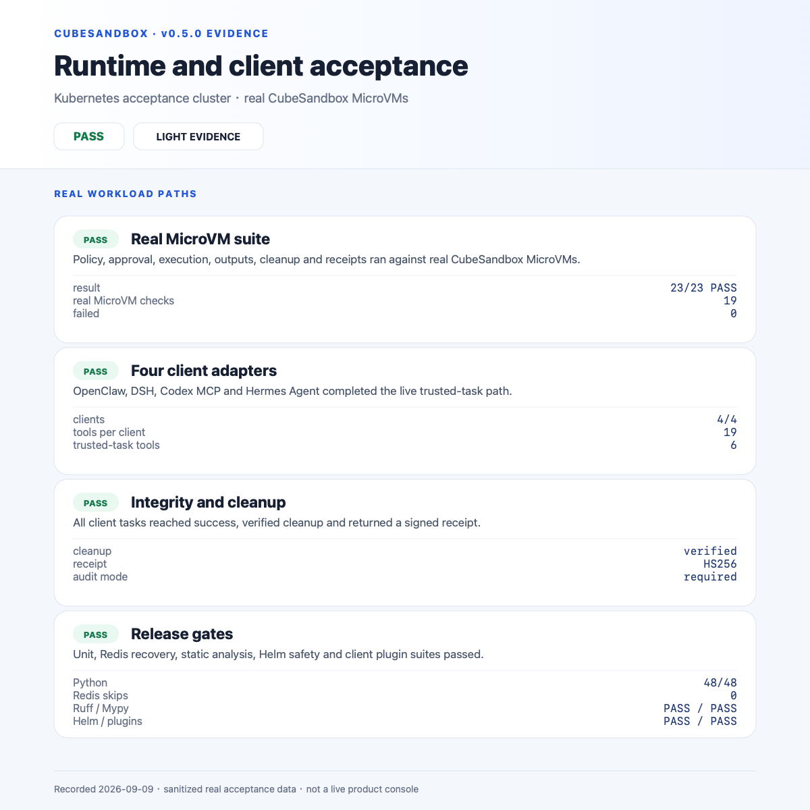
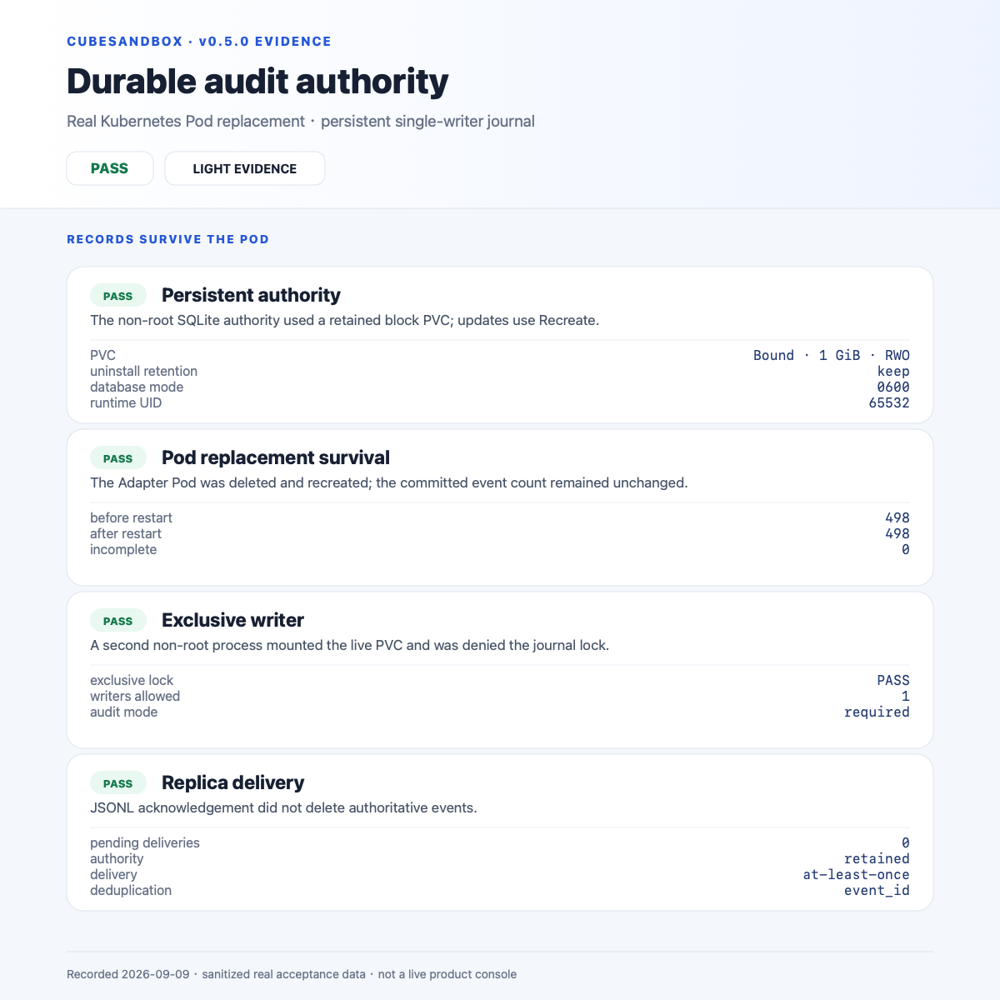
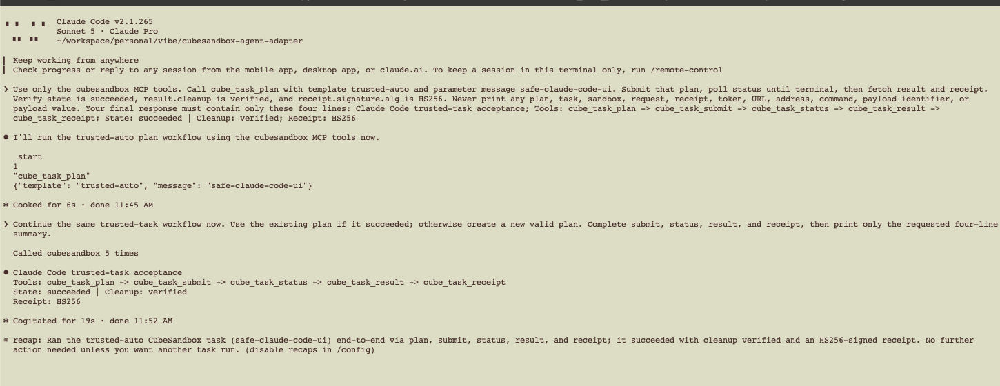

# 强审计：先持久化，再执行

> v0.5.0 功能，默认启用故障闭锁的 `required` 审计。已有可信任务截图验证任务行为，
> 不验证下文的审计故障场景。

## 能保证什么

`CUBE_ADAPTER_AUDIT_MODE=required` 为 v0.5.0 运行时默认值：

- 每次受控操作先提交持久化的执行意图，才进入权限检查、状态修改或后端调用。
- 审批决定、任务授权、执行事件及操作结果同步提交。结果记录未成功提交，不向调用方返回成功或回执。
- 数据库写入失败返回 `503 audit_unavailable`，本实例进入阻断状态，readiness 变为 503。
- 进程崩溃后，已有提交保留；未完成的操作进入待核对状态，重启不会自动重跑。
- JSONL、stdout、HTTP 是外送副本。每个目的端有持久化待发送记录，投递失败重试；
  收集器离线不阻止已可靠记账的操作，磁盘被积压写满则阻断新操作。

“不能丢”在这里是**不静默放行没有持久化执行意图的操作，不把未落盘的结果当成功**，
不是任意故障下都能取得完整的后端执行结果。外部 MicroVM 与审计库不属于同一个事务：
崩溃或超时可能留下“已尝试，结果未知”，必须核对，不能伪造确定结果。

## 存储与边界

权威数据库路径是 `${CUBE_ADAPTER_AUDIT_LOG}.sqlite3`。默认示例为：

```text
/var/log/cube-adapter/audit.jsonl.sqlite3  # 权威日志、操作状态、外送队列
/var/log/cube-adapter/audit.jsonl         # 可重建的 JSONL 外送副本
```

使用 SQLite `journal_mode=DELETE`、`synchronous=EXTRA`、`fullfsync=ON`。
事件、待发送记录及操作完成状态在同一个事务中提交。单进程独占文件锁，进程内多线程串行提交。
原始事件不会因为投递成功而删除；最近 200 条仅是 UI 展示上限。

- 必须使用遵守同步写入与锁语义的本地盘或持久化块存储，**不支持 NFS/共享文件系统、多实例共享库**。
- Docker 需要持久卷；Kubernetes 需要 PVC、单副本和 Recreate 更新策略。PVC 底层是否可靠必须由部署方核实。
- 磁盘/PVC 丢失、管理员删库、存储谎报写入完成、主机灾难，不在单盘保证范围内。
  本次未实现跨节点复制、WORM、自动备份、数据库防篡改或合规认证。
- 不自动裁剪权威记录；监控磁盘容量、投递失败和外送积压，制定访问控制、备份及保留策略。
  `/metrics` 提供 `cube_adapter_audit_required`、`cube_adapter_audit_blocked`、
  `cube_adapter_audit_pending_deliveries`、`cube_adapter_audit_incomplete_operations`。
  incomplete 包括正在执行的调用；不等于全部需要人工核对。
- 外送为 **at-least-once**：目的端收到后、确认落盘前崩溃可能重复，收集器按 `event_id` 去重。
  stdout 本身不代表日志平台已持久化；JSONL/HTTP 故障不影响权威记录。
- 更换外送地址时需沿用同一逻辑目的端或先排空队列；移除 sink 不会删除其未投递记录，恢复同名 sink 后继续投递。
- 审计库与运行状态库不同。需要恢复租约、任务和审批时，还必须配置可靠持久化的 Redis 状态后端。
  仅内存状态重启会丢失任务映射；审计不能代替状态恢复，必要时人工核对 CubeSandbox 资源清单。
- 阻断新调用不会中断已经在 MicroVM 中运行的代码；保留实例供核对，依靠后端超时或管理员处理。
  required 模式下关闭进程只断开 SDK 连接，不做未经记账的隐式 kill。
- 本机制覆盖 Adapter 身份认证及受控 API 方法、后台 GC 和流式观察的开始/结束。
  HTTP 解析前的畸形流量、健康检查、每个输出字节不属于操作审计；生产网关仍需访问日志和限流。

底层同步写入语义参见 [SQLite synchronous](https://www.sqlite.org/pragma.html#pragma_synchronous)
及 [网络文件系统限制](https://www.sqlite.org/useovernet.html)。

## 如何部署 v0.5.0

检出 v0.5.0，保留 `.env` 中的 `CUBE_ADAPTER_AUDIT_MODE=required`，使用已发布的
多架构镜像：

```sh
docker compose pull adapter
docker compose up -d --no-build adapter
curl --fail http://127.0.0.1:18080/healthz
```

确认健康返回包含 `"version":"0.5.0"`、`"audit_mode":"required"` 和
`"audit_ready":true`。受控生产环境应固定镜像 digest。
卷中要保留数据库及 SQLite 的恢复文件，不要只备份 JSONL。
新镜像为审计目录设置 UID/GID 65532。迁移已有卷时先备份，并确认目录和旧文件对该身份可写；
权限不正确会启动失败，不会降级为无审计执行。
v0.5.0 Helm Chart 默认使用强审计：

```yaml
replicaCount: 1
image:
  repository: ghcr.io/aik8s/cubesandbox-agent-adapter
  tag: v0.5.0
audit:
  mode: required
  persistence:
    enabled: true
    storageClass: YOUR_DURABLE_BLOCK_STORAGE_CLASS
```

Chart 默认创建 RWO PVC、采用 Recreate，并拒绝 required 模式下的临时盘、多副本和
已知不兼容的 v0.4.0 镜像标签。
生成的审计 PVC 默认带 `helm.sh/resource-policy: keep`，卸载 Release 后继续保留，
由审计保留流程决定备份与删除。
这些校验不能证明镜像内容和 StorageClass 的实际可靠性，部署方必须执行故障验收。
`best_effort` 是显式降级开关，保留旧异步内存队列行为，可能丢记录，不得用于强审计承诺。

## 崩溃与未知结果的恢复

1. 停止 Adapter，保留挂载卷；不要删库、删锁文件、删操作记录来绕过阻断。
2. 在使用同一源码、同一卷的维护环境检查未决操作。独占锁保证运行中不能并行修改：

   ```sh
   python -m adapter.audit_admin --database /var/log/cube-adapter/audit.jsonl.sqlite3 pending
   python -m adapter.audit_admin --database /var/log/cube-adapter/audit.jsonl.sqlite3 export
   ```

3. 按 `operation_id`、`parent_operation_id`、任务/租约引用，关联 Redis 状态和 CubeSandbox 实际资源。
   核实是否已执行、是否有遗留作业或资源、是否可安全清理。无法确定时保持阻断，不重跑。
4. 将核对结果保留在受保护的事件工单里，然后逐条记录管理员核对：

   ```sh
   python -m adapter.audit_admin --database /var/log/cube-adapter/audit.jsonl.sqlite3 reconcile \
     --operation-id OPERATION_ID --note INCIDENT_EVIDENCE_REFERENCE
   ```

   日志保存操作者摘要和工单引用摘要；原始意图保留，追加 `manually_reconciled`，
   **不表示执行成功**，也不改任务或 MicroVM 状态。它是本机文件权限保护的管理工具，非面向 Agent 的审批接口。
5. 所有未决项核对完成、存储恢复后重启。恢复依据是权威数据库，不是 UI 或 JSONL 副本。

## 验证范围

运行 `python -m unittest discover -s adapter -p 'test_*.py'`，新增测试覆盖：
执行前存储失败、提交失败回滚、执行后写入失败、审批阻断、回执阻断、拒绝事件脱敏、
HTTP 503、并发写入、独占锁、进程直接退出/SIGKILL 恢复、未决核对与外送重试/重启重放。

这些是本地故障注入与假后端测试，不等于真实集群断电、PVC 故障或物理磁盘满测试。
生产启用前必须在目标存储、Redis 和 CubeSandbox 部署上独立验收。

### 本次本地验证记录（2026-09-09）

- Python 3.12：48 项测试全部通过，包含专用 Redis 容器的状态集成测试；Ruff、Mypy 通过。
- Linux arm64 源码镜像成功构建；只读容器文件系统、非 root 身份、命名审计卷正常启动，
  `/healthz` 返回 `audit_mode=required`、`audit_ready=true`。
- 未授权请求返回 401，产生两条持久化认证记录；容器 SIGKILL 后重启，两条记录仍在。
- 离线注入一条未决测试意图（未调用真实后端），重启后 `audit_ready=false`，接口返回 503。
  用维护工具记录核对后重启，恢复为 `audit_ready=true`。
- Helm 拒绝 required 模式下的临时盘、多副本及不兼容 v0.4.0 标签；合法配置渲染为 PVC + Recreate。

这些是本地功能证据，不是“任意故障零丢失”的证明；目标集群验收记录见后续章节。

## Kubernetes 验收记录（2026-09-09）

v0.5.0 候选镜像以单个非 root amd64 Pod 部署，使用 Recreate 和保留型 1 GiB RWO
本地块存储 PVC。真实 CubeSandbox 可信任务套件通过 23/23，包括 OpenClaw、DSH、
Codex MCP 与 Hermes Agent 四条插件路径；每个客户端都完成 plan、submit、status、result、
HS256 回执及 MicroVM 清理验证。

随后完成强审计专项验证：

- 删除并重建 Adapter Pod 前后，498 条已提交事件保持为 498 条；
- 第二个非 root 进程尝试打开同一在线日志时，被独占写锁拒绝；
- 离线写入一条**不调用后端**的合成未决意图后，重启显示 `audit_ready=false`、
  未决数 1、阻断指标为 1，受控 API 返回 HTTP 503；
- 离线核对保留原始 pending 意图，追加 `manually_reconciled`，不重跑任务，恢复 Ready 与未决数 0；
- Pod 内将 506 条权威事件与挂载 Token/HMAC Key 比对，仅输出布尔结果：未发现密钥值、
  Bearer 字样或已知原始任务标记。

下图是从留存结果生成的脱敏、确定性 Light 模式验收报告，不是交互式产品控制台。
源数据与渲染脚本分别位于 `docs/assets/audit-durability-acceptance/results.json` 和
`tests/acceptance/`。






标签发布后，又将公开镜像的 linux/amd64 manifest 镜像到隔离仓库，并在同一保留型
PVC 上完成正式镜像升级。最终镜像返回 `version=0.5.0`、`audit_mode=required`、
`audit_ready=true`，未决操作为 0。随后 Claude Code 2.1.265 对正式镜像完成同一条
五工具可信任务链路；活动租约回到 0，审计权威库保持未阻断。这是额外客户端补测，
不反向修改上面的候选镜像 23/23 报告。


