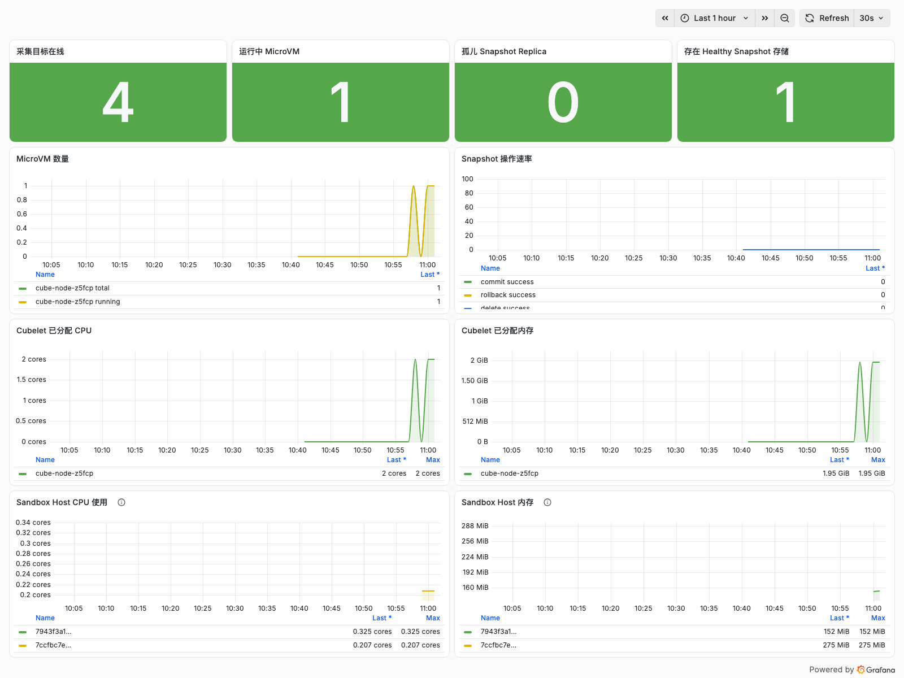

# CubeSandbox monitoring with Prometheus and Grafana

CubeSandbox v0.7.1 exposes native Prometheus endpoints. The sr1
kube-prometheus-stack integration and Grafana dashboard were verified on
2026-09-23.

| Component | Endpoint | Main signals |
| --- | --- | --- |
| CubeMaster | `:8089/metrics` | Snapshot operations, orphan replicas, storage mode, Go/process |
| CubeTemplateCenter | `:8090/metrics` | Template/Snapshot state and Go/process |
| Cubelet | `:9998/v1/metrics` | MicroVM count, scheduler quota, image/containerd and process metrics |
| Cubelet | `:9998/v1/metrics/resource` | Per-sandbox host/guest CPU and memory |

The resource endpoint can return HTTP 200 with an empty body when no sandbox is
running. On sr1 the resource plugin is enabled, collects every five seconds and
exports `host_sandbox` by default. Host accounting includes VMM and CubeShim
overhead and is not the guest working set.

The endpoints have no built-in authentication or TLS. Keep them on a trusted
management network; do not expose them through a public NodePort, Ingress or
LoadBalancer.

Apply the two ServiceMonitors and the two-path PodMonitor:

```bash
kubectl --context sr1 apply \
  -f deploy/monitoring/cubesandbox-sr1-monitors.yaml
```

The manifest carries the selector required by sr1 Prometheus and limits the
Cubelet metric families to control cardinality. Verify the four targets with:

```promql
up{
  cluster="sr1",
  cubesandbox_component=~"master|templatecenter|cubelet|cubelet-resource"
}
```

All four targets returned `up=1` in the live acceptance. The Grafana dashboard
is [`cubesandbox-sr1.json`](assets/grafana/cubesandbox-sr1.json), uses datasource
UID `sr1-prometheus`, and is installed on sr1 at
`/d/cubesandbox-sr1/cubesandbox-sr1` with UID `cubesandbox-sr1`.

The light-mode capture below was taken while a temporary sandbox generated CPU
and memory load. Both resource series were observed, public legends retain only
the first eight characters of the sandbox ID, and CubeMaster reported zero
active sandboxes after cleanup. The redacted record is
[`cubesandbox-sr1-result.json`](assets/grafana/cubesandbox-sr1-result.json).



For production, give each backend a stable `cluster` label, monitor target and
snapshot health, bound `sandbox_id` cardinality, and deliver both monitors and
dashboards through Helm or GitOps. Guest-workload metrics require a compatible
cube-agent and cgroup v2; old templates may expose only host-sandbox metrics.
