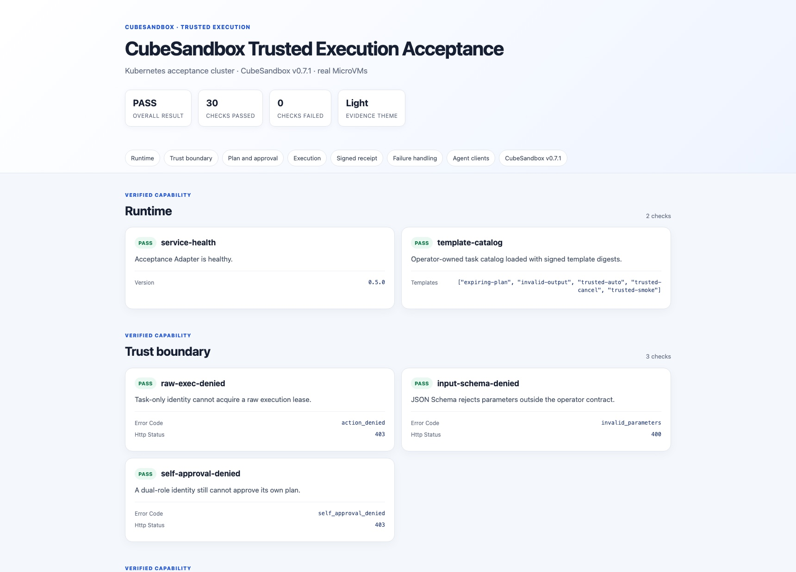
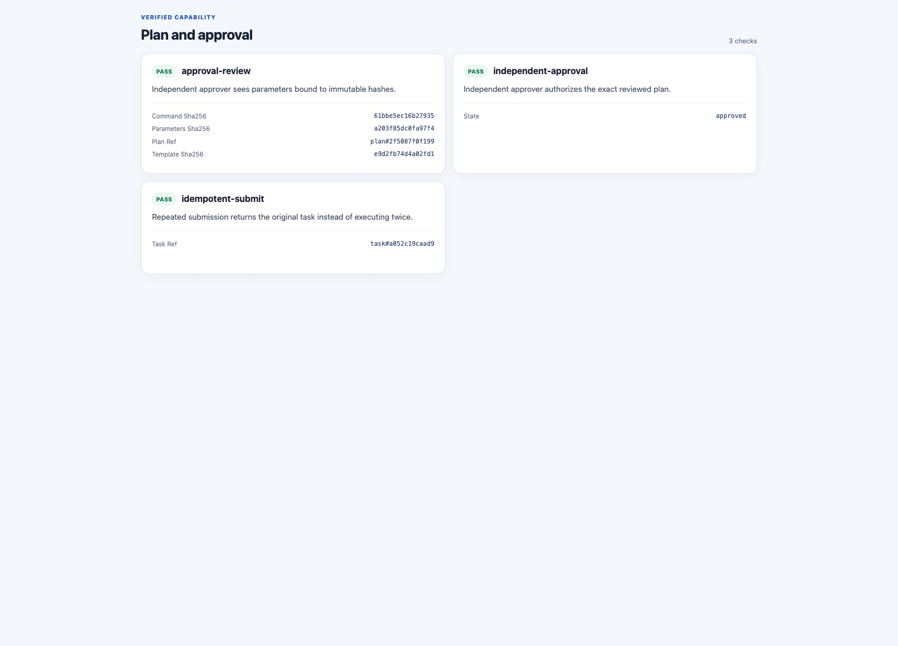
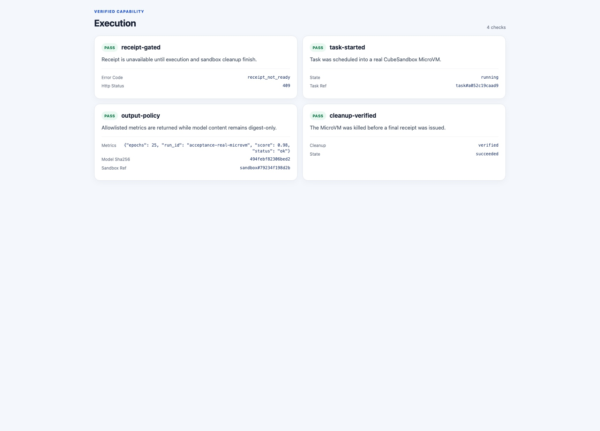
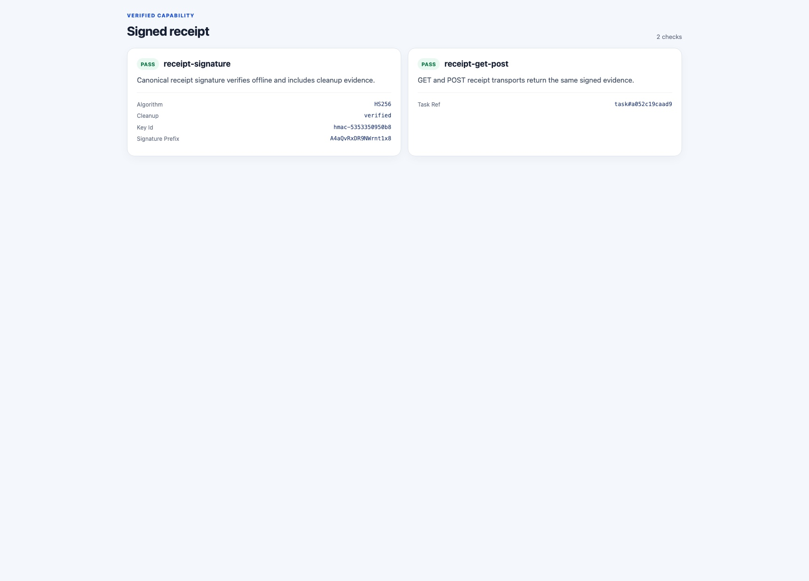
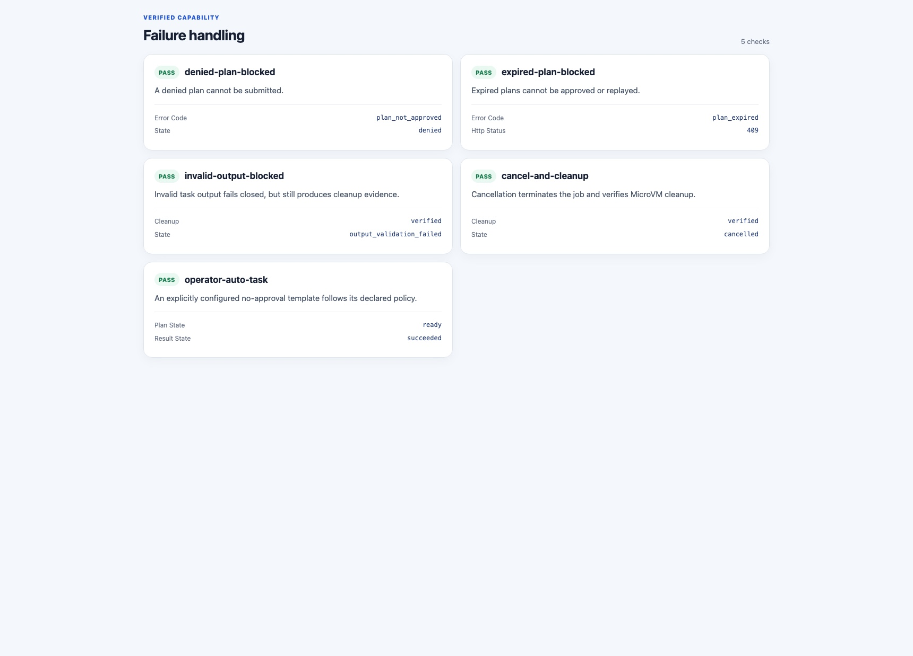
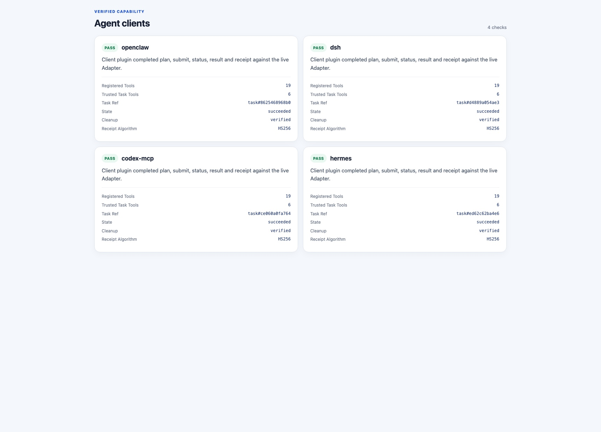
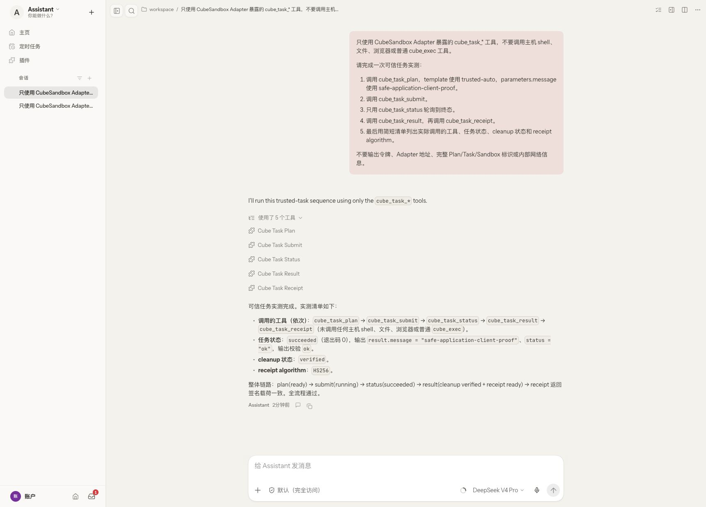
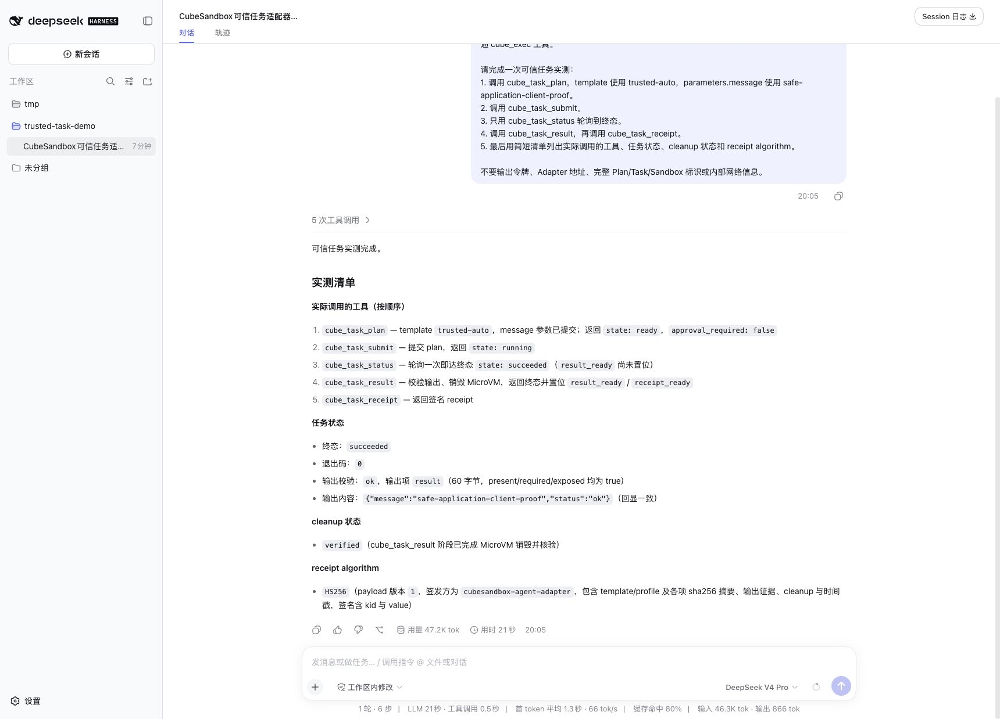
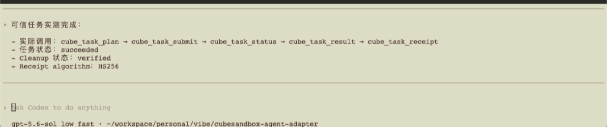
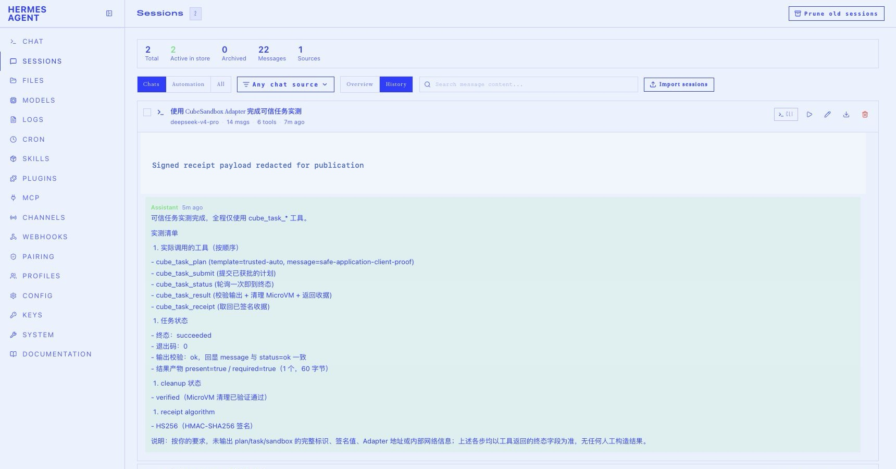

# Controlled execution from local code agents to production resources

For a first installation, complete the [Docker Compose guide](deploy-docker.md)
or [Kubernetes setup](../README.md#quick-start-kubernetes-adapter) and verify basic
sandbox execution before configuring the task templates and approval identities below.

Developers often want to keep a familiar local code agent while datasets,
internal services, GPUs, and production systems remain inside an isolated
production network. Giving the laptop direct production access—or passing
production credentials to the model—unnecessarily expands the trust boundary.

CubeSandbox Agent Adapter can act as the production-side execution broker:

```text
local code agent in the office network
          |
          | HTTPS + mTLS/OIDC + tenant identity
          v
production access gateway -> Adapter -> named task + JSON Schema
                                      -> independent approval
                                      -> operator-owned profile
                                            |
                                            v
                                   CubeSandbox MicroVM
                                   | read-only data / scoped identity
                                   | no public or allowlisted internal egress
                                   v
                                training or data-cleaning job
```

The local agent receives only opaque plan/task references and approved results. Cube
credentials, full Sandbox IDs, mounted datasets, and production workload
identities stay on the production side. The task contract fixes the command
argument vector, profile, output paths, disclosure mode, and limits. The model
cannot inject a shell fragment, select a different Cube template, enable public
traffic, or extend lifecycle limits.

This is a **policy-controlled, isolated, and auditable execution plane**, not a
hardware-attested confidential-computing TEE. Add SGX, TDX, SEV, or another
confidential-computing layer when host confidentiality, memory encryption, or
remote attestation is required.

## Useful patterns

- Run small or single-node training directly inside a pinned MicroVM template.
- For distributed/GPU training, use the MicroVM as a narrow submission broker
  to an internal training API; never give a local agent a cluster-admin
  kubeconfig.
- Mount approved production datasets read-only, clean or validate them inside
  the MicroVM, and return only aggregate reports or approved artifact handles.
- Use durable jobs for long-running work, with bounded runtime, cancellation,
  tenant quotas, and lifecycle cleanup.

## Enforced task workflow

Set `CUBE_ADAPTER_TASK_TEMPLATES_FILE` to an operator-owned YAML file such as
[`task-templates.yaml`](../examples/trusted-execution/task-templates.yaml).
Each task defines a closed JSON Schema, fixed `argv`, Cube profile, approval
requirement, and output allowlist. Dynamic values replace only a whole argument
and are shell-quoted individually; partial placeholders such as
`prefix-${value}` are rejected at startup.

```text
plan -> pending_approval -> approved -> submitted/running
                                      -> succeeded -> outputs validated
                                                   -> MicroVM killed
                                                   -> signed receipt
```

Use separate principals from
[`token-principals.example.json`](../config/token-principals.example.json):

- the local Agent gets `task:plan`, `task:submit`, `task:status`,
  `task:result`, `task:cancel`, and `task:receipt`, but no `exec:run`,
  `job:start`, file, artifact, PTY, or checkpoint actions;
- the production approver gets only `task:approve` and role `approver`;
- `allowed_task_templates` and `allowed_profiles` restrict both identities.

An Agent therefore cannot approve its own task or bypass the contract through
a raw execution endpoint. Once the job succeeds, the Adapter validates only
configured outputs, returns content only for `expose: content`, records digests
for `expose: digest`, kills the MicroVM, and emits an HS256 receipt. Prefer a
dedicated `CUBE_ADAPTER_RECEIPT_HMAC_KEY`; verify an exported receipt offline
with `scripts/verify_receipt.py --key-file ...`.

For Kubernetes, put the task YAML in a ConfigMap and set
`taskTemplates.enabled=true` plus `taskTemplates.existingConfigMap=<name>` in
the Helm release. Store task-only and approver principals in the auth Secret,
set `auth.tokenPrincipalsKey`, and optionally set `auth.receiptHmacKey` to a
separate Secret key. Redis-backed encrypted state is recommended because Plans,
approvals, Tasks, and receipts must survive an Adapter restart.

Runnable reference material is under
[`examples/trusted-execution/`](../examples/trusted-execution/), including
profiles, MCP host configuration, prompts, a deterministic training task, and a
CSV cleaning task. The [Chinese guide](trusted-execution.zh-CN.md) contains the
complete threat model and deployment checklist.

## Security limits

- An isolated MicroVM does not prevent data exfiltration through stdout, file
  reads, or artifact downloads. Apply output allowlists, review, and DLP.
- `allow_public_traffic: false` must be combined with destination-level internal
  network policy.
- Production data should be mounted or accessed with a short-lived workload
  identity, not transferred through the local agent.
- HMAC receipts prove integrity only to parties that share the operator key;
  they are not public-key remote attestation. Keep verification keys outside
  Agent credentials.
- The current flow supports one independent approver. Quorum approval,
  revocation callbacks, DLP engines, dataset catalogs, and workload-identity
  issuance remain production-platform integrations.

## Live acceptance evidence

The screenshots below come from real CubeSandbox MicroVM execution in an
isolated acceptance namespace, not a UI mock. The suite passed 23/23 checks.
All captures use the light theme and exclude tokens, addresses, full internal
identifiers, raw commands, and task data.

Overall result, service health, template catalog, and trust boundary:



Plan review, independent approval, and idempotent submission:



Real MicroVM execution, output policy, and verified cleanup:



Offline signature verification and consistent receipt transports:



Denied, expired, invalid-output, cancellation, and no-approval paths:



OpenClaw, DSH, Codex/MCP, and Hermes each completed the live plan, submit,
status, result, and receipt flow with verified MicroVM cleanup:



### Client-native application evidence

The summary cards above correlate the backend checks. The following captures
come from each client application's own light-theme interface while it used the
new trusted-task flow. Every client called `cube_task_plan`,
`cube_task_submit`, `cube_task_status`, `cube_task_result`, and
`cube_task_receipt`, then reported `succeeded`, verified cleanup, and an HS256
receipt.

OpenClaw Control UI, showing the five Adapter tool calls and final result:



DeepSeek Harness Web, showing the same five calls and output validation:



Codex CLI 0.153.2, using the Adapter's stdio MCP server with only the five
trusted-task tools enabled:



Hermes Agent 0.20.6 in its official Dashboard. The session's six-tool count is
one `tool_describe` discovery call plus the same five `cube_task_*` calls:



Publication captures omit tokens, Adapter and model-gateway addresses, complete
Plan/Task/Sandbox identifiers, and private network details. The raw signed
receipt payload in the Hermes history is visibly redacted; its final status,
cleanup result, and signature algorithm remain visible.
